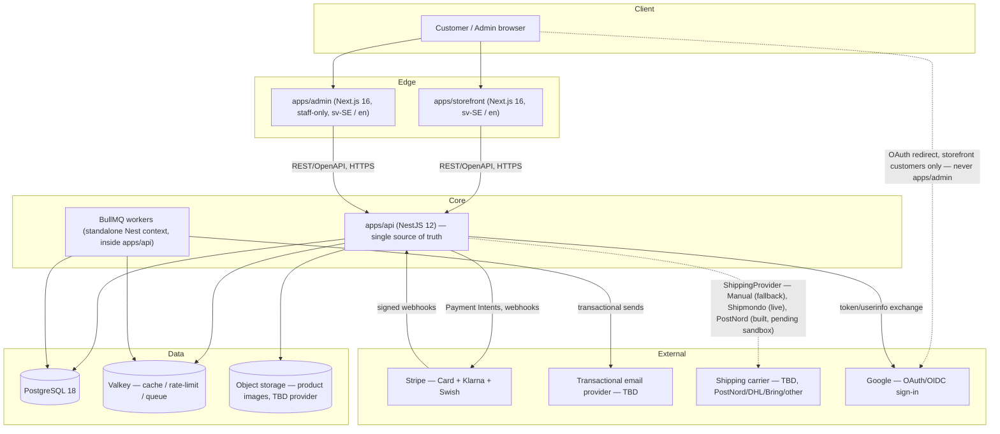

# Architecture — Âme de Fil

See `DECISIONS.md` for the reasoning and alternatives behind every choice below.

## 1. System overview



**Key rule (from the brief, non-negotiable):** `storefront` and `admin` never talk to PostgreSQL or Stripe directly. They are authenticated HTTP clients of `apps/api`. All pricing, stock, discount, and payment-status logic is computed and verified server-side.

**Google sign-in is a storefront-customer convenience, not an admin authentication mechanism.** `apps/admin` has exactly one way to authenticate — email/password via `POST /auth/login` (`SECURITY.md` §1, `DECISIONS.md` ADR-032) — the same session/RBAC guard chain every other admin endpoint already depends on. Google OAuth (`DECISIONS.md` ADR-033) exists only as `GET /auth/google`/`GET /auth/google/callback`, reachable from `apps/storefront`; nothing in `apps/admin` calls it, and there is no SSO of any kind for staff.

## 2. Monorepo structure

The brief's proposed structure is sound; it is adopted with one addition (`packages/email`) and `packages/database` clarified as **Prisma-only, consumed exclusively by `apps/api`** (never imported by `storefront`/`admin` — enforced by not adding it as a dependency of those apps, not just by convention).

```
ame-de-fil/
├── apps/
│   ├── storefront/        # Next.js 16 — customer-facing, sv-SE/en, SSR+RSC, SEO-critical
│   ├── api/                # NestJS 12 — REST/OpenAPI, owns all writes, hosts BullMQ workers
│   └── admin/              # Next.js 16 — staff-only, sv-SE/en, no public SEO surface, same design tokens
├── packages/
│   ├── ui/                  # shadcn-derived component source, design tokens, Tailwind preset
│   ├── types/                # Shared TS types + generated OpenAPI client types
│   ├── validation/           # Zod schemas — single source of truth for form + DTO validation
│   ├── config/                # Shared tsconfig, eslint base, Tailwind theme tokens, env schema
│   ├── eslint-config/          # Flat ESLint config, shared across all apps/packages
│   ├── email/                  # React Email transactional templates (used only by apps/api)
│   └── database/                # Prisma schema, migrations, seed scripts — apps/api only
├── docs/
├── .github/workflows/
├── turbo.json
├── pnpm-workspace.yaml
└── package.json
```

**Why `packages/validation` matters here specifically:** the brief is explicit that prices/stock/discounts must never be trusted from the browser. Sharing Zod schemas means the _shape_ of a valid `AddToCartRequest` etc. is defined once, but the schema only ever checks shape/format — business rules (is this variant actually in stock, is this discount actually active) are re-derived server-side from the database on every request, never taken from client input. Shared validation is a DX/consistency tool, not a trust boundary.

## 3. API contract

REST, versioned from day one (`/api/v1/...`), documented via NestJS's Swagger module. A typed client is generated at build time into `packages/types` (or a dedicated `packages/api-client`) so `storefront`/`admin` get compile-time safety without hand-maintained fetch wrappers.

Domain modules in `apps/api` (Nest modules, one per bounded context): `identity` (users/roles/sessions), `catalog` (products/variants/categories/collections), `inventory`, `cart`, `checkout`, `orders`, `payments`, `shipping` (carrier-agnostic `ShippingProvider` abstraction — `ManualShippingProvider` fallback, `ShipmondoShippingProvider` (live), `PostNordShippingProvider` (built, pending sandbox) — `DECISIONS.md` ADR-022/037/038/039/040), `discounts`, `reviews`, `customers`, `admin` (cross-cutting admin operations), `dashboard`, `tasks`, `addresses`, `marketing`, `notifications`, `audit`.

## 4. Rendering & data-flow strategy (storefront)

- **Server Components by default**; client components only where interactivity requires it (cart drawer, quantity steppers, filter UI, checkout form).
- Product/category/collection pages are rendered server-side against `apps/api`, with Next.js's caching (`revalidate`/tag-based invalidation) fronting read-heavy catalog data — **the API remains authoritative**; caching is a performance layer the API can invalidate (e.g., on stock/price change), not a second source of truth.
- Cart and checkout are always fetched fresh (no stale cache) given they involve stock and price.

## 5. Background processing

Abandoned-checkout follow-up (beyond reservation release), webhook-retry backoff, and low-stock digest emails are planned to run as BullMQ jobs against Valkey. Workers start as a Nest **standalone application context** inside `apps/api` (`NestFactory.createApplicationContext`) rather than a separate deployable app — this keeps the three-app surface from the brief intact. Revisit (split into `apps/worker`) only if worker load needs to scale independently of the HTTP API.

**Reservation expiry and transactional email are two exceptions, both implemented differently:**

- Reservation expiry (`DECISIONS.md` ADR-025) runs as an `@nestjs/schedule` in-process interval (`ReservationExpiryScheduler`), not a BullMQ job — the release logic is simple and idempotent enough not to need BullMQ's retry/backoff/dead-letter machinery, and BullMQ requires Valkey, which isn't provisioned in this environment either. Swapping it for a real BullMQ delayed job later doesn't touch `ReservationExpiryService` itself, only its trigger.
- Transactional email (`DECISIONS.md` ADR-031) is dispatched **synchronously**, in-process, immediately after the triggering transaction (order confirmation, shipment marked shipped) commits — not queued at all. `NotificationsService` never throws back to its caller, so a slow or failed send can't roll back the order/shipment write it followed, but this also means there is no retry/backoff and no durability across a process crash between commit and send — see ADR-031's own "idempotency and crash/retry behavior" section for exactly what that does and doesn't cover. A real BullMQ-backed outbox is the natural upgrade path if that gap needs closing.

## 6. Open architectural questions

Market/locale/currency scope is now confirmed (Sweden-only, `sv-SE`+`en`, SEK-only — `DECISIONS.md` ADR-021). Resolved since: image storage — Cloudinary (ADR-034); shipping carrier — Shipmondo/DHL Freight, live-verified (ADR-037/038/039), plus a direct PostNord integration built and unit-tested but not yet sandbox-verified (ADR-040, pending PostNord account signup and a customer/agreement number). Still open, by your explicit choice: deployment target and email vendor (`DECISIONS.md` ADR-020) — generic SMTP is wired and works against a real Mailpit catcher locally, but no production vendor has been chosen.
