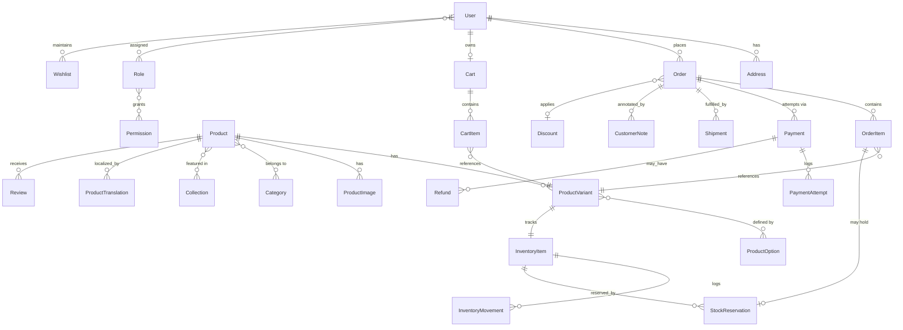

# Database Architecture — Âme de Fil

**No Prisma schema is created in this phase** (per discovery constraints). This document describes the conceptual data model, relationships, and the concurrency design for inventory — the schema itself is Phase 1 work.

## 1. Entities from the brief, confirmed

`User`, `Role`, `Permission`, `Address`, `Product`, `ProductVariant`, `Category`, `Collection`, `ProductImage`, `ProductOption`, `InventoryItem`, `InventoryMovement`, `Cart`, `CartItem`, `Wishlist`, `Order`, `OrderItem`, `Payment`, `PaymentAttempt`, `Refund`, `ShippingMethod`, `Shipment`, `Discount`, `Coupon`, `Review`, `CustomerNote`, `Notification`, `AuditLog` — all confirmed as necessary. Design notes:

- `ProductVariant` is the sellable unit (SKU, price, weight, stock link); `Product` is the editorial/marketing unit (story, base images, collection membership). A variant is a combination of `ProductOption` values (e.g. Color=Rust, Size=M).
- `InventoryItem` is 1:1 with `ProductVariant` for ready-to-ship stock; made-to-order variants still get an `InventoryItem` row (with `tracksStock=false` and a `productionTimeDays`) so the same reservation/order pipeline handles both without a type-branch through the checkout code.
- `ShippingMethod` is the **customer-facing** shipping option (e.g. "Standard", "Express") — name, translated label, price, estimated delivery window. It carries **no carrier-specific fields**; carrier selection/booking/tracking is fully delegated to the `ShippingProvider` abstraction (`DECISIONS.md` ADR-022, carrier deliberately not yet chosen), never modeled in the domain. `Shipment` tracks the actual fulfillment event against an `Order` — status, and for v1's `ManualShippingProvider`, a free-text `carrierName`/`trackingNumber` entered by admin (not a foreign key into a carrier table, since no carrier is selected).

## 2. Additional entities recommended (beyond the brief's list)

| Entity                                                               | Why it's needed                                                                                                                                                                                                                                                                                                                                                                                                                 |
| -------------------------------------------------------------------- | ------------------------------------------------------------------------------------------------------------------------------------------------------------------------------------------------------------------------------------------------------------------------------------------------------------------------------------------------------------------------------------------------------------------------------- |
| `ProductTranslation`, `CategoryTranslation`, `CollectionTranslation` | next-intl (`ARCHITECTURE.md`/`DECISIONS.md` ADR-007) only localizes UI strings. Product names, editorial stories, care instructions, and SEO metadata are **content**, not UI copy, and must be translatable per-locale (`sv-SE`/`en` — confirmed 2-locale scope, ADR-021) independently of the codebase. One row per (entity, locale).                                                                                         |
| `TaxRate` / `TaxClass`                                               | Swedish moms (25% standard, 12%/6% reduced) must be applied server-side and stored per order line at the time of sale (rates change; historical orders must keep the rate that applied). Market/shipping is Sweden-only (confirmed, ADR-021) — **no cross-border EU VAT OSS logic is needed**; a single jurisdiction's rate tiers is sufficient.                                                                                |
| `StockReservation`                                                   | A reservation is a distinct lifecycle object from `CartItem` and `InventoryMovement`: it has its own `expiresAt`, is created at checkout-start (not at add-to-cart — see §4), and is what the periodic expiry sweep releases on expiry (§4). Modeling it explicitly (rather than overloading `InventoryMovement`) makes "what's currently reserved vs. what's currently committed" a single indexed query instead of an aggregate over movements. |
| `Session`                                                            | Required by the hand-rolled auth decision (ADR-015) — opaque token, `userId`, `expiresAt`, `userAgent`/`ip` for anomaly/audit purposes. Also carries `csrfToken` (added during the Phase 1 API checkpoint — SECURITY.md §3's double-submit CSRF design needed somewhere to persist it, which the original schema didn't have).                                                                                                  |
| `WebhookEvent`                                                       | Idempotency ledger for inbound Stripe webhooks — primary key on the provider's event ID, so a duplicate delivery (Stripe explicitly retries and _will_ send duplicates) is a no-op, not a double-processed payment.                                                                                                                                                                                                             |
| `IdempotencyKey`                                                     | For client-supplied idempotency keys on order/payment-creation endpoints (protects against double-submit from a flaky network on checkout, independent of Stripe's own delivery retries).                                                                                                                                                                                                                                       |
| `BackInStockSubscription`                                            | Handmade/limited-edition inventory means "sold out ready-to-ship" is a normal, frequent state, not an edge case — customers expect to be notified. Small addition, high perceived-premium value.                                                                                                                                                                                                                                |
| `ConsentRecord`, `DataSubjectRequest`                                | GDPR: track cookie/marketing consent with timestamp+version, and log erasure/export requests and their fulfillment status — required for EU operation, not optional (`SECURITY.md` §GDPR).                                                                                                                                                                                                                                      |
| `GiftCard` / `StoreCredit`                                           | **Not built in v1** unless confirmed in scope (`PRODUCT_SPEC.md` §6) — listed here only so the schema has a slot reserved (e.g. an `OrderItem.type` discriminator) if added later, avoiding a painful retrofit.                                                                                                                                                                                                                 |

## 3. Conceptual relationships (high level)

## 4. Inventory concurrency design

This is the highest-risk part of the schema — the brief is explicit: **never trust client stock info, design for race conditions.**

**Reservation timing:** stock is **not** reserved on add-to-cart (that would let idle browser tabs lock up limited-edition stock indefinitely). It is reserved when checkout is _initiated_ (i.e. when the customer submits shipping/payment step), with a short TTL (e.g. 15 minutes).

**Flow:**

1. Checkout-start → within a single **Postgres transaction**, `SELECT ... FOR UPDATE` the target `InventoryItem` row(s), verify `available = onHand - reserved >= requestedQty`, insert a `StockReservation` row with `expiresAt = now() + 15m`, increment `reserved`. Row-level locking (not optimistic retry) is used here because checkout-start is low-frequency-per-item relative to browsing, so lock contention is cheap, and it gives a hard guarantee rather than a retry loop.
2. **Implemented**: rather than a per-reservation BullMQ delayed job scheduled for each `expiresAt`, a periodic sweep (`ReservationExpiryScheduler`, `@nestjs/schedule`, `apps/api/src/checkout/reservation-expiry.scheduler.ts` — `DECISIONS.md` ADR-025) runs on a configurable interval (`RESERVATION_EXPIRY_SWEEP_INTERVAL_MS`, default 1 minute) and queries for every reservation whose `expiresAt` has already passed, not just one. For each, it re-checks the reservation is still `PENDING` (not already consumed by a completed payment) and, if so, releases it — decrements `reserved`, marks the reservation `EXPIRED`, and (in the same transaction) cancels the still-`PENDING_PAYMENT` order — **idempotent**: safe to run twice, safe to race against step 3, and safe under multiple running instances (each sweeps independently; the guarded update means only one ever actually claims a given reservation).
3. On a verified `payment_intent.succeeded` webhook (never on browser redirect — see `PAYMENTS.md`), within a transaction: confirm the `StockReservation` is still valid (not expired/consumed) — the reservations are read via `SELECT ... FOR UPDATE` first (`order-reservation-lock.ts`), specifically so this check is race-safe against step 2 rather than a stale read. If still valid, convert it to a permanent decrement (`InventoryMovement` of type `SALE`, `onHand -= qty`, `reserved -= qty`), mark the reservation `CONSUMED`, and transition the `Order`/`Payment` state machines. If the reservation already expired before the webhook arrived (slow customer + fast TTL), the order is **not** silently confirmed — it goes to a `PAYMENT_SUCCEEDED_STOCK_LOST` admin-alert state for manual resolution (refund or backorder), rather than either overselling or silently taking money for nothing. **This guard matches the order in either `PENDING_PAYMENT` or `CANCELED`** — step 2 may have already canceled the order by the time this webhook arrives (the exact race just described), and that cancellation must not block the stock-lost transition, or the order would be stuck showing `CANCELED` under a `PAID` payment with no admin-visible signal. See `PAYMENTS.md` §4a / `DECISIONS.md` ADR-026 for the full race narrative and why matching `CANCELED` here can't misfire on an unrelated cancellation.
4. Made-to-order variants (`tracksStock=false`) skip stock reservation/decrement entirely — checkout proceeds straight to payment, and fulfillment tracks `productionTimeDays` from `Order` confirmation instead.

**Isolation level:** `READ COMMITTED` with explicit `FOR UPDATE` row locks is sufficient and simpler than `SERIALIZABLE` for this access pattern (all contention is on a known row, not on predicate ranges); `SERIALIZABLE` is reserved as a fallback if a specific race is found in testing that row locks don't cover (e.g. multi-item basket reservations needing consistent ordering to avoid deadlock — mitigated by always locking `InventoryItem` rows in a stable order, e.g. sorted by primary key, within a single reservation transaction).

**Cancellations/refunds:** a canceled order or refund before fulfillment re-adds `onHand` via a compensating `InventoryMovement` (type `RETURN`/`CANCELLATION`), never a raw UPDATE — every stock change is auditable through the movement log.

## 5. Money representation

All monetary amounts are stored as **integers in minor currency units** (öre) with an explicit `currency` column alongside every amount — never floats, never an implicit "store currency." Historical order/payment amounts are immutable snapshots; current product prices are separate, mutable rows. **Currency is SEK only (confirmed, ADR-021)** — the `currency` column is kept for correctness/future-proofing (never hardcode SEK into calculation logic) but is a constant value in practice for v1.

## 6. Implementation notes (Phase 1 schema — `packages/database/prisma/schema.prisma`)

The Prisma schema is written and validated (`prisma validate`/`prisma generate` both pass — see the Phase 1 report). A handful of underspecified points from the conceptual design above were resolved concretely while writing it; recorded here per the rule that implementation decisions materially clarifying the architecture get reflected back into the docs:

- **`StockReservation` attaches to `OrderItem`, not `CartItem`** (§3 ERD corrected above). The original conceptual ERD linked it to `CartItem`, but by checkout-start — when a reservation is created — an `Order` in `PENDING_PAYMENT` already exists per the Order state machine (`PAYMENTS.md` §3: `DRAFT → PENDING_PAYMENT: checkout started, stock reserved`). The reservation's lifecycle matches the order's, not the cart's (which can persist indefinitely across sessions), so it's modeled against `OrderItem`.
- **Translation strategy is two-tier, not one uniform pattern.** Multi-field editorial content (`Product`, `Category`, `Collection` — name, slug, description, SEO metadata, etc.) uses a full per-locale translation table, as designed. Single-field catalog content (`ProductOptionValue.label`, `ProductImage.altText`, `ShippingMethod.name`) uses flat `xxxSv`/`xxxEn` columns instead of a separate table — a full generic translation table is disproportionate for one field at a fixed 2-locale count (ADR-021). `ProductOption.key` (e.g. "color") is _not_ translated in the database at all — it's a small closed vocabulary treated as a `next-intl` UI string, unlike option _values_ (e.g. "Rust"), which are open-ended catalog content and do get the `labelSv`/`labelEn` treatment.
- **`Order` stores immutable shipping/billing address snapshots as embedded fields**, not a foreign key to the customer's `Address` book. `Address` remains the mutable, editable account address book (used to prefill checkout); an order's address must never change if the customer later edits or deletes a saved address, so it's copied at order-creation time — the same immutability principle §5 already applies to money, extended to addresses.
- **`TaxClass`/`TaxRate` are time-versioned** (`validFrom`/`validTo`); `OrderItem.taxRatePercent` snapshots the resolved rate at sale time, decoupled from the live rate table, satisfying "historical orders must keep the rate that applied."
- **No `GiftCard`/`StoreCredit` scaffolding was added** — not even a reserved discriminator column. `PRODUCT_SPEC.md` §6 keeps this an open, unconfirmed non-goal; adding "just in case" columns for an unconfirmed feature would be exactly the speculative design the brief warns against. If confirmed later, it's an additive migration.

## 7. Implementation notes (Stripe payment checkpoint)

One additive model, `OrderStatusToken` (migration `20260909000000_add_order_status_token`) — everything else the Stripe integration needed (`Payment`, `PaymentAttempt`, `WebhookEvent`, `IdempotencyKey`, `StockReservation`, `InventoryItem`, `InventoryMovement`) already existed from the Phase 1 schema and required no change. `OrderStatusToken` is the guest order-status polling credential (`PAYMENTS.md` §9, `DECISIONS.md` ADR-024) — one row per `Order` (`orderId` unique), storing only a SHA-256 hash of the token, never the plaintext, with an `expiresAt`. Modeled as its own table rather than columns on `Order`, mirroring how `Session` is its own table rather than columns on `User`.

**Not applied to a live database in this checkpoint** — no Postgres instance was reachable in this environment (`DEPLOYMENT.md` §1's already-disclosed Docker/WSL gap). The migration SQL was hand-authored to match Prisma's own generated `CREATE TABLE`/index/constraint conventions exactly (cross-checked against the existing `init` migration's `Session`/`StockReservation` tables for naming) rather than generated via `prisma migrate dev`, since that requires a reachable shadow database. `prisma validate` and `prisma generate` both pass against the updated schema (verified directly, not asserted) — the migration itself has not been verified by actually running it against Postgres, which remains pending whenever that environment gap is resolved.

**Update (later checkpoint, `DECISIONS.md` ADR-026):** the Docker/WSL gap was resolved and `prisma migrate deploy` was run against a real local Postgres instance — both migrations, including this one, applied cleanly. The full checkout → PaymentIntent → webhook → state-transition flow (§4 above) was then exercised live against real Stripe test-mode credentials and this schema, surfacing and fixing two real defects invisible under mocked tests (a Prisma create-payload/schema field mismatch, and a P2002-duplicate-key detection helper written against the wrong Prisma query-engine's error shape) before the reservation-expiry/payment race (§4 step 3, `PAYMENTS.md` §4a) was even reachable to test.
