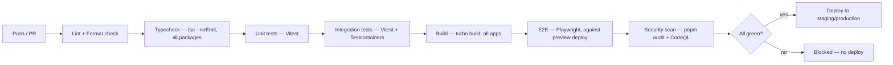

# Deployment & CI/CD — Âme de Fil

## 1. Environments

| Environment | Purpose                                                                      | Data                                  |
| ----------- | ---------------------------------------------------------------------------- | ------------------------------------- |
| Local       | `docker-compose` (Postgres, Valkey, SMTP catcher) + `pnpm dev` via Turborepo | Seeded fixtures                       |
| Preview     | Ephemeral, per-PR (e.g. per-branch deploy)                                   | Isolated/seeded, resettable           |
| Staging     | Pre-production, mirrors prod config, Stripe **test** mode                    | Anonymized/synthetic                  |
| Production  | Live                                                                         | Real, EU-resident (`SECURITY.md` §10) |

**Environment gap noted in this discovery:** Docker is not currently installed in this WSL2 dev environment (`docker: command not found`, WSL integration not enabled in Docker Desktop). This blocks local `docker-compose` testing until resolved — flagged for you to address before or during Phase 1.

## 2. CI/CD pipeline (GitHub Actions)

- Turborepo remote caching so unaffected packages skip re-execution on every PR (e.g. a storefront-only change doesn't re-run API integration tests) — `turbo.json` task graph scopes this correctly by declaring real input/output dependencies, not by manual path filtering.
- `Dependabot` (or Renovate) configured for automated dependency update PRs, gated by the same CI pipeline.
- Database migrations (`prisma migrate deploy`) run as an explicit, separate, gated CI/CD step — never automatically on app boot — so a bad migration can't take down a running production instance on deploy.
- Production deploys only proceed after every stage above is green, per the brief's explicit requirement.

## 3. Containerization

- `apps/api` (and its embedded worker context) ships as a multi-stage Docker image. Prisma 7's Rust-free engine (ADR-009) removes the native-binary/OS-target matching pain that historically made Prisma+Alpine Docker images fragile — a meaningful DX and image-size win here.
- `storefront`/`admin` containerization is conditional on the hosting decision (§4) — if deployed to Vercel, no Docker image is needed for them at all; if self-hosted, they get their own multi-stage `next build`/`next start` images.

## 4. Deployment target — open question

Not decided in this phase (needs a product/business decision on budget and ops appetite). Documented candidates, for reference only:

- **Storefront/Admin:** Vercel (native Next.js fit, image optimization and edge caching out of the box) vs. self-hosted (Docker on a general cloud, more control/cost predictability at scale, more ops burden).
- **API + Postgres + Valkey:** a container platform (Fly.io, Railway, Render) for low-ops simplicity, vs. AWS/GCP/Azure directly (more control, more setup, easier to satisfy EU-data-residency + compliance requirements at scale via e.g. RDS in `eu-north-1`/`eu-west-3`).
- **Constraint that _is_ fixed regardless of provider:** EU/EEA data residency for the database and object storage (`SECURITY.md` §10) given `sv-SE` customer PII (Sweden-only market, confirmed — ADR-021). A Nordic/Swedish region option (e.g. AWS `eu-north-1` Stockholm) is now a natural fit given the market is Sweden-only, but the vendor itself remains deferred.

See `DECISIONS.md` ADR-020 — explicitly deferred by you, to be confirmed before Phase 1 infra/deployment work specifically (not before Phase 1 schema/scaffold work).

## 5. Observability (baseline, expand post-launch)

- Structured JSON logging from `apps/api` (correlation/request ID propagated end-to-end, including into BullMQ job logs).
- Error tracking (Sentry or equivalent) across `storefront`/`admin`/`api` — vendor TBD alongside the hosting decision.
- Uptime/health checks (`/health` endpoint on `apps/api`, checked by the deploy platform before routing traffic — supports zero-downtime rollout).
- Payment reconciliation job (`PAYMENTS.md` §5) alerts on mismatch, not just logs it.

## 6. Rollback

Given migrations are a separate gated step (not tied to app boot), a bad deploy can roll back the application image/build independently of the database — migrations are written expand/contract-style (additive first, destructive changes only after the old code path is fully retired) specifically so a code rollback never leaves the DB in an incompatible state.
