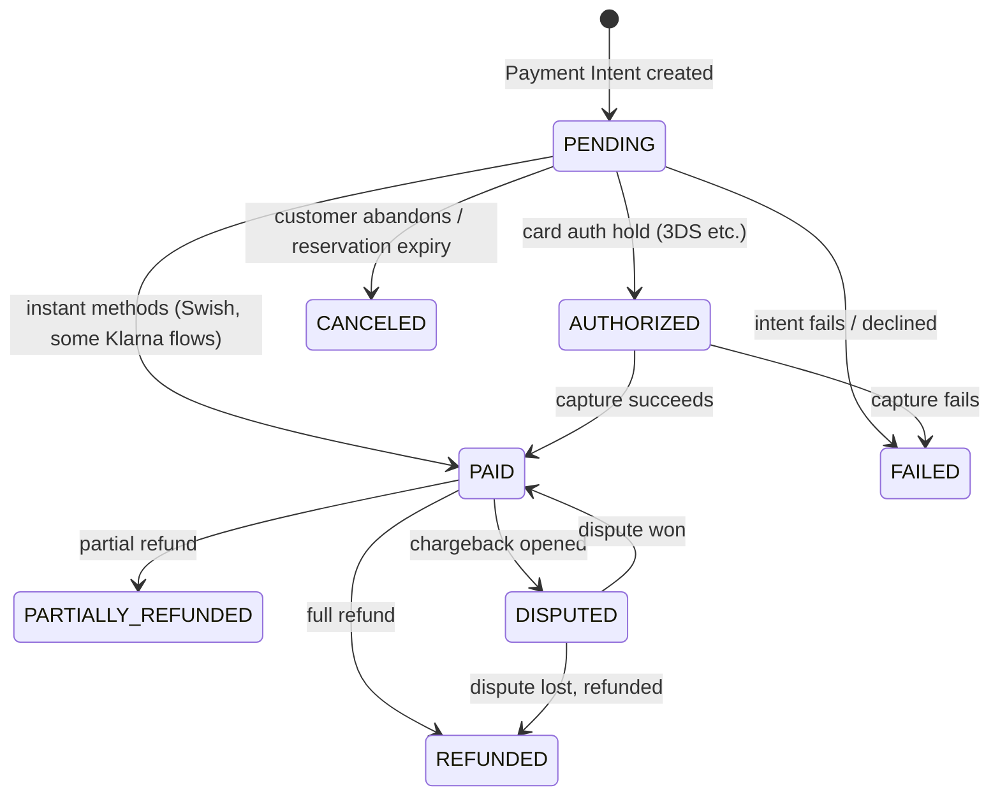
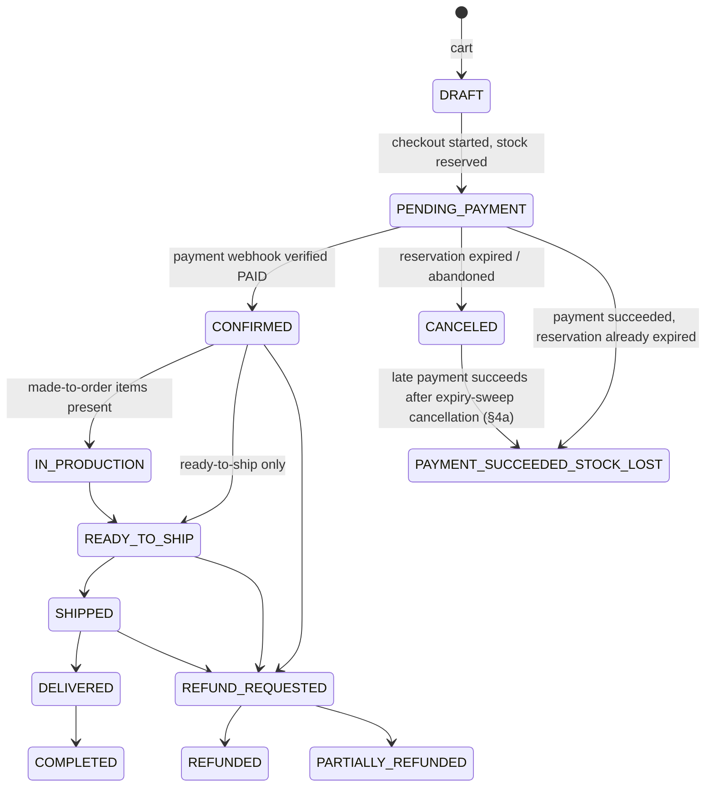

# Payment Architecture — Âme de Fil

See `DECISIONS.md` ADR-014 for the rationale (**flagged for your confirmation**) behind routing Klarna and Swish through Stripe in v1 rather than building direct integrations.

## 1. Provider abstraction

**Implemented** (`apps/api/src/payments/payment-provider.ts`), narrower than the original illustrative sketch — `getStatus()` is deliberately not part of the interface (storefront/admin never ask the provider for status, they read DB state instead, §4). `refund()` **is implemented** (admin-refunds checkpoint, §6) — deliberately the one method that does **not** accept a `Prisma.TransactionClient`, unlike `createPayment`: it must never run from inside a DB transaction/lock (§6 explains why):

```ts
interface PaymentRecord {
  id: string;
  provider: string;
  status: PaymentStatus;
  amountMinor: number;
  currency: string;
  clientSecret?: string; // set only by a provider the browser must confirm against
}

interface VerifiedWebhookEvent {
  providerEventId: string;
  eventType: string;
  providerPaymentIntentId: string | null;
  outcome: "succeeded" | "failed" | "canceled" | "paymentMethodRecorded" | "irrelevant";
  paymentMethodType?: string | null; // set only for "paymentMethodRecorded" — §4's charge.succeeded handling
  raw: unknown;
}

interface RefundResult {
  providerRefundId: string;
  status: "succeeded" | "pending" | "failed"; // only "succeeded" is treated as money actually moved — §6
}

interface PaymentProvider {
  createPayment(tx: Prisma.TransactionClient, input: CreatePaymentInput): Promise<PaymentRecord>;
  refund(input: {
    providerPaymentIntentId: string;
    amountMinor: number;
    idempotencyKey: string;
  }): Promise<RefundResult>;
  verifyWebhookSignature(rawBody: Buffer, signature: string): VerifiedWebhookEvent;
}
```

```
PaymentProvider
├── StripePaymentProvider      # implemented — card + Klarna via Stripe Payment Intents, automatic capture
│   (KlarnaPaymentProvider / SwishPaymentProvider as direct-integration
│    implementations are a documented future path, not built — ADR-014;
│    Swish is deferred — see ADR-028: rejected by Stripe today because it
│    isn't activated on this account's Dashboard, a Stripe account action,
│    not a code gap)
└── PendingPaymentProvider     # fallback when STRIPE_SECRET_KEY/STRIPE_WEBHOOK_SECRET are unset —
                                 records a PENDING Payment row, contacts no processor
```

**Payment method types (`ADR-028`):** `StripePaymentProvider.createPayment` passes an explicit `payment_method_types` array (`ENABLED_PAYMENT_METHOD_TYPES` in `stripe-payment.provider.ts`) rather than `automatic_payment_methods` — this keeps the offered methods exactly what ADR-014 confirmed (card, Klarna; Swish once activated), instead of whatever the Stripe account's Dashboard happens to have toggled on (the prior `automatic_payment_methods` config was silently also offering Link and Amazon Pay, neither ever confirmed in scope). Verified live against this project's Stripe test account: `card`+`klarna` accepted; `swish` rejected with `"The payment method type 'swish' is invalid... ensure the provided type is activated in your dashboard"`. Adding Swish back is a one-line change to that array once the Dashboard activates it — no other code change needed.

Klarna is confirmed working end-to-end in Stripe **test mode** (real checkout → real Klarna sandbox redirect and confirmation → real webhook processing, verified live in this checkpoint). Stripe.js itself also warns in the browser console that Klarna "will be displayed in test mode, but hidden in live mode" until activated on the Dashboard — so, like Swish, Klarna will need that same one-time account activation step before a production launch; unlike Swish, it does not block **testing** it today.

`CreatePaymentInput` passed into `createPayment` carries only server-computed amounts (`CheckoutService`'s own totals, never a client-supplied number) — the browser never supplies a total that gets charged. `PaymentsModule` selects between the two implementations at boot via a `useFactory` reading `STRIPE_SECRET_KEY`/`STRIPE_WEBHOOK_SECRET` — this is the same "disclosed rather than faked" posture already used elsewhere in this project for the Docker/reservation-expiry-scheduler gaps, so the app boots and checkout still works end-to-end (with a PENDING-only payment) wherever Stripe test keys aren't available.

## 2. Payment state machine



`DISPUTED` is added beyond the brief's list — card disputes/chargebacks are a normal operational reality and need an explicit admin-visible state (`ADMIN.md`-equivalent section in this doc / admin dashboard §Orders).

## 3. Order state machine (independent of payment)



Order and Payment are deliberately **separate** state machines (per the brief) — an order can be `REFUND_REQUESTED` while its payment is still transitioning to `REFUNDED`; they're correlated, not merged, so partial fulfillment/partial refund scenarios (one item refunded, rest shipped) don't force an artificial combined state.

**Admin fulfillment implemented (`DECISIONS.md` ADR-029, extended by ADR-030):** `CONFIRMED`/`IN_PRODUCTION → READY_TO_SHIP → SHIPPED → DELIVERED` — three admin-only endpoints (`apps/api/src/orders/admin-orders.controller.ts`, `orders.fulfill` permission), each a guarded conditional transition (illegal-from-state calls reject with `409`, never silently no-op — unlike the webhook/sweep paths, a manual admin action on the wrong order state is a real mistake, not a race to tolerate). `POST .../ship` records `Shipment.carrierName`/`trackingNumber`/`trackingUrl` (all optional free text, ADR-022). `markReadyToShip` accepts both `CONFIRMED` and `IN_PRODUCTION` as predecessors (ADR-030): an order lands on `IN_PRODUCTION` instead of `CONFIRMED` at confirmation time when any line is made-to-order, with `OrderItem.madeToOrder`/`productionTimeDaysSnapshot` snapshotted at checkout. **Deliberately not built:** an "estimated ready date" computed or surfaced anywhere from `productionTimeDaysSnapshot` — a Phase 5 display concern layered on top of the snapshot, not state-machine work. No admin UI either — `apps/admin` has no order pages yet; that's Phase 5's "order management" scope, which will call these same endpoints.

## 4. The core rule: webhooks, not redirects

**An order is never marked `CONFIRMED`, and money is never considered received, because the browser was redirected to a "success" URL.** The success-page redirect only ever shows an optimistic "we're confirming your payment" state. The authoritative transition happens exclusively when:

1. A Stripe webhook arrives at `POST /api/v1/payments/webhooks/stripe` (`payments-webhook.controller.ts`) — `@Public()`/`@SkipCsrf()`, not cookie-authenticated, verified by signature instead.
2. Its signature is verified against the webhook secret (`StripePaymentProvider.verifyWebhookSignature`, `stripe.webhooks.constructEvent` against the raw, untouched request body — `main.ts`'s `rawBody: true`).
3. Its event ID is checked against `WebhookEvent` (idempotency ledger, `DATABASE.md` §2) — if already processed, return 200 and no-op (`payments-webhook.service.ts`).
4. Inside a DB transaction, the reservation is converted to a commit and the state machines advance (`DATABASE.md` §4) — see §3's matrix below.

**v1 handles a narrower event set than eventually needed**: `payment_intent.succeeded` / `payment_intent.payment_failed` / `payment_intent.canceled` for state transitions, plus `charge.succeeded` for one purely informational purpose (below); every other event type (including `payment_intent.processing`, `payment_intent.requires_action` — seen live for Klarna's redirect step, `charge.updated`, dispute events) is acknowledged (200) and no-opped, not yet acted on. Automatic capture is used for v1 card payments, so `PaymentStatus.AUTHORIZED` stays unused (reserved for a future manual-capture or Klarna/Swish flow, same posture as `User.totpSecret` under ADR-015).

**`charge.succeeded` → `Payment.method` (ADR-028):** the `Payment` model has a `method String?` column recording which underlying method (`"card"`/`"klarna"`/`"swish"`) a payment actually used — populated from this event's `payment_method_details.type`, correlated back to the `Payment` row via `charge.payment_intent` (a Charge's own id is not a PaymentIntent id). Purely informational: this never drives a state transition, is idempotent by construction (writing the same value twice is a no-op in effect), and is handled in a dedicated branch precisely so it can never be mistaken for a failure/cancellation outcome.

**On a definitive failure/cancellation, the reservation is released immediately** (not left to the 15-minute TTL) and the order transitions straight to `CANCELED` — a deliberate extension beyond §3's diagram (which only shows expiry-triggered cancellation), reasoned as: once Stripe has told us definitively the payment won't succeed, there's no reason to make the customer wait out the TTL before retrying checkout.

The frontend never trusts `stripe.confirmPayment()`'s own resolution as "the order is confirmed" — it only uses that to decide when to start polling `GET /api/v1/orders/:orderId/status` (§9), which reflects DB state, not Stripe state, and is the only thing that ever renders a "confirmed" UI.

## 4a. The reservation-expiry vs. payment-success race (`DECISIONS.md` ADR-026)

`ReservationExpiryScheduler` (§7) and this webhook handler act on the same `Order`/`StockReservation` rows independently and asynchronously — the sweep on a fixed interval, the webhook whenever Stripe's customer-facing payment confirmation actually completes. Nothing prevents a slow customer's payment from confirming _after_ their reservation's TTL has already expired. This is a real, reachable race — not a hypothetical — verified live against a real database and the real Stripe test API:

1. A reservation's `expiresAt` passes while its order's `PaymentIntent` is still `PENDING` — the customer hasn't finished confirming payment yet.
2. `ReservationExpiryService.releaseExpiredReservations()` (§7) releases the reservation (`StockReservation → EXPIRED`, `InventoryItem.reserved` decremented) and, in the same transaction, cancels the order (`Order.status → CANCELED`) — because as far as the sweep can tell, this order was simply abandoned.
3. **The order must retain an explicit, distinguishable status here** — not because `CANCELED` is wrong at the moment the sweep writes it (it's the correct guess given what's known then), but because a _later_ payment success must still be recognized as "stock lost," not silently absorbed into an ordinary cancellation. This is why `PAYMENT_SUCCEEDED_STOCK_LOST` exists as its own `OrderStatus` value rather than being inferred after the fact from `CANCELED` + `Payment.status`: the order's own status is the single source of truth an admin queue filters on, and it must be able to say "this one needs you" on its own.
4. The customer's payment then succeeds anyway (3DS delay, slow network, a retried card entry) and the real, signature-verified `payment_intent.succeeded` webhook arrives. `PaymentsWebhookService.confirmOrderOrFlagStockLost` locks the order's reservations (`order-reservation-lock.ts`, race-safe against a concurrent sweep — `DATABASE.md` §4), finds at least one no longer `PENDING`, and writes: `Payment.status → PAID` (already true by this point — the payment update happens earlier in `handleSucceeded`) and `Order.status → PAYMENT_SUCCEEDED_STOCK_LOST`. The guard matches the order in **either** `PENDING_PAYMENT` (the sweep hasn't run yet) **or** `CANCELED` (the sweep already won the race) — both are valid predecessors for this exact transition, and `canceledAt` is cleared in the `CANCELED` case, since the order didn't actually end up canceled.
5. **No inventory decrement and no `InventoryMovement` row are created for this order** — the reservation stays `EXPIRED`, exactly as the sweep left it; the stock-lost branch never touches `InventoryItem` or writes a `SALE` movement (`DATABASE.md` §4 step 3). Never oversell, and never pretend the stock is still there.
6. If instead the payment definitively **fails or is canceled** (Stripe tells us so, not a redirect), the order simply becomes `CANCELED` as normal (§4, "a deliberate extension...") — there is no money captured, so there is nothing to flag; ordinary abandonment and definitive payment failure both land on the same terminal state, correctly.
7. **An ordinary `CANCELED` order is never reclassified by an unrelated `payment_intent.succeeded` webhook.** The stock-lost branch only runs for the specific `Payment` row a given event's `providerPaymentIntentId` resolves to, and in the current implementation `CANCELED` has exactly two sources: this sweep, and a definitive Stripe failure/cancellation on that _same_ PaymentIntent (`handleFailedOrCanceled`). The second source is unreachable by the time a `succeeded` event for that PaymentIntent could arrive — `handleSucceeded`'s own `Payment.status = PENDING` guard (checked earlier, independently) already rejects it, since a failed/canceled webhook already moved `Payment.status` away from `PENDING`. So an order found `CANCELED` at this point can only be this exact race, never a different cancellation being incorrectly reopened by a stray event.
8. **Why this matters:** without step 4's broadened guard, the sweep winning the race left `Payment.status = PAID` sitting under `Order.status = CANCELED` forever — money genuinely captured, but the order looking like an ordinary abandoned cart, with no admin-visible signal that anything needs attention. `PAYMENT_SUCCEEDED_STOCK_LOST` existing as a real, always-reachable terminal state (regardless of which side of the race won) is what turns "silently keep the money for nothing" into a state an admin queue can actually query for.

## 5. Idempotency, retries, reconciliation

- **Client-side idempotency:** checkout submission carries a client-generated `Idempotency-Key` header; `apps/api` stores it against the resulting order/payment so a retried submit (double-click, flaky network) never creates a duplicate order.
- **Checkout-transaction-retry idempotency (implemented):** `CheckoutService.initiate` retries its own transaction up to 3 times on an `orderNumber` collision, which could otherwise call `createPayment` more than once for what's logically one checkout attempt. `StripePaymentProvider.createPayment` passes Stripe's own request-level `idempotencyKey` (derived from the order, `checkout-payment-intent:{orderId}`), so a retried call returns the _same_ PaymentIntent rather than creating a duplicate.
- **Webhook retries (implemented):** Stripe retries undelivered/failed webhooks automatically; `PaymentsWebhookService.handle` is safe to receive the same event N times — it claims the event ID in `WebhookEvent` first (a plain `create`, P2002-on-duplicate treated as already-handled) before any business logic runs, and every state-changing write inside is itself a guarded conditional update (`WHERE status = <expected>`), so even a near-simultaneous duplicate that slips past the ledger claim is a no-op past that point.
  - **Deviation from the original design, disclosed:** heavy work is _not_ handed to a BullMQ job — there is no BullMQ/queue infrastructure in this repo at all (a separate, pre-existing gap). Webhook processing runs synchronously in the request handler; at v1's expected volume this stays well under Stripe's delivery timeout, but revisit once background-job infrastructure exists.
- **Reconciliation: not built.** The nightly Stripe-vs-`Payment` diff job described here remains future work, same as before. It's now also the intended home for detecting **orphaned PaymentIntents** — see the transaction-boundary note below.
- **Accepted v1 trade-off — orphaned PaymentIntents:** `StripePaymentProvider.createPayment` runs _inside_ `CheckoutService`'s existing single checkout transaction (the `PaymentProvider.createPayment(tx, ...)` signature requires it — kept exactly as designed, not redesigned for this checkpoint). If that transaction fails to commit for a reason other than the two retried cases above (rare — an unexpected error after the Stripe call succeeded), an uncharged `PENDING` PaymentIntent can exist at Stripe with no matching local `Order`/`Payment` row. This is deliberately accepted rather than solved with a bigger transactional redesign (e.g. an outbox pattern) — the exposure is an orphaned, harmless Stripe object, not a financial or security issue, and building for it now would be exactly the kind of speculative complexity this project avoids without evidence it's a real problem. Flagged here as a named, intentional gap: the future reconciliation job above should list Stripe PaymentIntents with no matching local `Payment.providerPaymentIntentId` and cancel/alert on them.

## 6. Refunds

**Implemented** (`AdminOrdersService.issueRefund`, `apps/api/src/orders/admin-orders.service.ts`) — `POST /admin/orders/:orderId/refund`, gated by `orders.refund` (`SECURITY.md` §2), requiring an `Idempotency-Key` header (same convention as `POST /checkout`). Amount-based only (v1) — no per-line-item refund selection; the admin supplies `amountMinor` (and an optional free-text `reason`), capped by the payment's own remaining refundable amount, never by a client-supplied ceiling.

**Eligibility:** the order's `Payment` must be `PAID` or `PARTIALLY_REFUNDED`; the requested amount must not exceed `Payment.amountMinor` minus every existing `PENDING`-or-`SUCCEEDED` `Refund` against it ("remaining"). A full refund (cumulative `SUCCEEDED` total reaches `Payment.amountMinor`) drives `Payment`/`Order` to `REFUNDED`; a partial refund drives both to `PARTIALLY_REFUNDED`. `OrderStatus.REFUND_REQUESTED` remains unused (no async/manual-approval step in v1 — a refund is issued synchronously or not at all).

**Concurrency / over-refund protection:** two concurrent refund requests against the same `Payment` can never collectively exceed its remaining refundable amount. The mechanism is a `SELECT ... FOR UPDATE` lock on the `Payment` row, held only for a short reservation transaction (no network call inside it): that transaction computes "remaining" from `PENDING`+`SUCCEEDED` refunds (a `PENDING` row is a genuine reservation, not just a prior read) and, still under the lock, creates the new `Refund` row as `PENDING` before releasing it. A concurrent request racing for the same budget sees the reservation, not a stale read, so at most one of two over-committing requests can ever reserve. The Stripe call itself happens strictly _after_ this transaction commits and the lock is released — Stripe is never asked to refund an amount the database has already rejected. `AdminOrdersService.applyRefundEffects` takes the same Payment-row lock again when writing Order/Payment/inventory effects, for a related but distinct race: two _different_ refunds on one payment completing at nearly the same time could otherwise both read a stale cumulative total and double-apply an additive effect (see "double-restock" below).

**Failure-ordering guarantees:**

- A failed Stripe call marks the `Refund` row `FAILED` and touches nothing else (no `Order`/`Payment`/inventory/`AuditLog` write) — the reserved amount stops counting against "remaining" immediately.
- A **successful** Stripe call is never silently lost if a later write fails: `Refund.status = SUCCEEDED` and `providerRefundId` are persisted in their own small transaction _immediately_ on Stripe's response, before the Order/Payment/inventory/audit effects are even attempted. If that later step fails, the `Refund` row's success is already durable.
- **Idempotency at the provider boundary:** `StripePaymentProvider.refund` passes an idempotency key derived from our own `Refund.id` (never the admin's raw `Idempotency-Key` header) — a retried/resumed call returns Stripe's original refund object rather than creating a second one. Verified against real Stripe test mode: an identical `idempotencyKey` returns the identical `refund.id` on a second call.
- **Bounded v1 recovery, not full reconciliation:** if Stripe succeeds and the durable-proof write commits, but the subsequent Order/Payment/inventory/audit write fails, the next refund attempt on that same `Payment` (`reconcileOutstandingRefunds`) re-applies any `SUCCEEDED` refund whose `AuditLog` marker doesn't exist yet before doing anything else. **This is not a background job** — if no further refund attempt ever touches that payment again, the inconsistency (Payment/Order status, inventory, audit trail lagging behind a `SUCCEEDED` refund) can persist until one does, or until a real reconciliation job is built (same disclosed-gap posture as §5's reconciliation-job note above). `applyRefundEffects` itself is idempotent, keyed on whether this refund's own `AuditLog` row already exists.
- **Double-apply / double-restock protection:** the Order/Payment status transitions are naturally convergent (each recomputes the true cumulative total from the DB, so repeated or reordered application settles on the same correct final state) — but restocking is an _increment_, not a convergent set, so it is gated on the row-count of the guarded `Order` status UPDATE (`WHERE status <> 'REFUNDED'`) actually changing something, not on the plain "is this now a full refund" boolean. Two different refunds completing at nearly the same time can both observe an already-full cumulative total (each's own `SUCCEEDED` write happens, unlocked, before either reaches this code), but Postgres serializes their `Order`-row UPDATEs and re-evaluates the guard for whichever runs second — so restocking (and the accompanying `RETURN` `InventoryMovement`) still happens exactly once. Verified with a real-Postgres integration test running two genuinely concurrent within-budget refunds that together total the full amount.

Refunds restore inventory via a compensating `InventoryMovement` (`DATABASE.md` §4) only for a **full** refund on an order that has **not shipped** (`SHIPPED`/`DELIVERED`/`COMPLETED`, `admin-orders.service.ts`'s `SHIPPED_ORDER_STATUSES`); partial refunds never auto-restock, and a shipped order's refund never auto-restocks either — both are left as a manual admin decision via `POST /admin/inventory/:variantId/adjustments`, since the physical item's condition is unknown.

**Synchronous confirmation only — disclosed limitation:** the caller trusts Stripe's own resolved `refund.status` from that single API call; there is no webhook that later resolves a non-terminal `pending`/`requires_action` outcome (`StripePaymentProvider.refund` maps only `succeeded` to success, `failed`/`canceled` to failure, and passes everything else through as `PENDING` with no further follow-up built). A `PENDING` refund's reserved amount keeps counting against "remaining" indefinitely until a later refund attempt under the same `Idempotency-Key` resumes it — a known, accepted v1 gap for the same reason as this section's other disclosed limitations: no async reconciliation exists yet.

**Idempotency-Key scoping (verified, not assumed reusable from checkout):** `IdempotencyKey.key` is a single global primary key and `scope` is stored but never filtered on by checkout's own lookup — reusing a raw client header value here could collide with an unrelated checkout key. `admin-orders.service.ts`'s `refund-idempotency.ts` namespaces the key as `admin-refund:{orderId}:{clientKey}` instead, requiring no schema change. Unlike checkout's simpler "only ever the final response" snapshot, a refund's `IdempotencyKey.responseSnapshot` also captures an interim `{ phase: "pending", refundId }` state after the reservation but before the Stripe call — because a refund can't complete in one transaction (the Stripe call must happen outside any lock), a crash mid-flight must be _resumable_ under the same key (reusing the same `Refund.id`, and therefore the same Stripe idempotency key), not just replayed-or-rejected. An identical key + identical request body replays the final result (or resumes an unfinished one); the same key with a different request body returns `409`.

## 7. Abandoned checkout

`PENDING_PAYMENT` orders whose reservation expires without a `PAID` webhook transition to `CANCELED` automatically — **implemented** via `ReservationExpiryScheduler` (`apps/api/src/checkout/reservation-expiry.scheduler.ts`), not a BullMQ job as originally sketched (see `DECISIONS.md` for why). If a payment succeeds anyway _after_ this cancellation already ran, the order does not stay `CANCELED` — see §4a for that race and why it resolves to `PAYMENT_SUCCEEDED_STOCK_LOST` instead.

**A fully made-to-order order gets no `StockReservation` at all** (every line has `tracksStock: false`, so `CheckoutService.initiate` never creates one — `DATABASE.md` §4), which left it invisible to the reservation-driven sweep above regardless of how long it sat in `PENDING_PAYMENT`. `ReservationExpiryService.releaseExpiredReservations` now has a second, independent branch for exactly this: any `PENDING_PAYMENT` order older than `CHECKOUT_RESERVATION_TTL_MINUTES` (measured from `Order.createdAt`) with no reservation on any of its lines (`items: { every: { reservation: null } }`) is canceled the same way, folded into the same `canceledOrders` result — no new config value, since "how long we wait for the customer to pay" applies whether or not stock is actually reserved. A mixed order (some tracked lines, some made-to-order) is unaffected by this branch and continues to be canceled by the reservation-driven path once its real reservation expires.

A separate, lower-priority "abandoned cart" email job (distinct from checkout abandonment) may re-engage customers who left items in `Cart` without ever starting checkout — product decision, not built in v1 unless confirmed.

## 8. Security notes (cross-ref `SECURITY.md`)

- Stripe secret keys and webhook signing secrets live only in `apps/api`'s runtime secrets (`STRIPE_SECRET_KEY`/`STRIPE_WEBHOOK_SECRET`) — never shipped to `storefront`/`admin`. Only the publishable key (`NEXT_PUBLIC_STRIPE_PUBLISHABLE_KEY`, non-secret by Stripe's own design) reaches the browser, for `@stripe/stripe-js`/`@stripe/react-stripe-js`'s Payment Element.
- PCI scope is minimized by using Stripe's Payment Element / hosted fields — raw card data never touches our servers, and `apps/storefront` never calls the Stripe API directly for anything business-logic-bearing (intent creation, confirmation amounts) — it only ever renders the client-secret-scoped Payment Element apps/api already gave it.
- `apps/storefront`'s CSP (`next.config.ts`) is scoped to what Stripe.js/Payment Element need: `script-src` allows `https://js.stripe.com`, `frame-src` allows `https://js.stripe.com`/`https://hooks.stripe.com`, `connect-src` allows `https://api.stripe.com`. `script-src`/`style-src` also carry `'unsafe-inline'` — a disclosed trade-off for Next.js's own unnonced inline hydration scripts (verified live: without it, Next's own bootstrap script is blocked), not something loosened for Stripe's sake.
- Refund admin actions are written to `AuditLog` (`action: "order.refund_issued"`, actor, before/after `Payment`/`Order` status, amount, IP) — **implemented** (§6), applied by `applyRefundEffects` and attributed to the refund's original `initiatedByUserId`, never to whichever later action happened to trigger a reconciliation re-apply.

## 9. Guest order-status polling (`DECISIONS.md` ADR-024)

`GET /api/v1/orders/:orderId/status` (`apps/api/src/orders/`) is what §4's "poll rather than trust the redirect" rule actually calls. Deliberately minimal by design:

- **Response is `{ status, payment: { status } }` only** — no addresses, line items, amounts, or any other order/customer PII. The storefront already holds the full order detail from the original checkout response (kept in `sessionStorage` client-side, `checkout-order-storage.ts`, to survive a possible Stripe 3DS redirect) — this endpoint only ever confirms whether it's safe to trust that already-held data, never re-serves it.
- **Authenticated caller:** authorized purely by `Order.userId` ownership — no token involved.
- **Guest caller:** authorized by a dedicated `X-Order-Status-Token` header (never a query parameter, to keep it out of server/proxy access logs) — a 256-bit (`randomBytes(32)`, base64url) token, returned once in the checkout response's `orderStatusToken` field, stored server-side only as its SHA-256 hash (`OrderStatusToken.tokenHash`) — deliberately diverging from `Session.id`'s plaintext-token convention, since this is a bearer credential traveling in a header rather than an httpOnly cookie. Scoped to exactly one order (`orderId` unique on the table), time-limited (`ORDER_STATUS_TOKEN_TTL_HOURS`, default 2h) but reusable within that window (not single-use — the polling loop calls it repeatedly by design).
- **Identical 404** for a nonexistent order, a wrong/expired/mismatched-order token, or an authenticated non-owner — this endpoint can never be used to enumerate which order IDs exist.
- Light per-IP rate limit (`@RateLimit`) — hygiene against abuse/scraping, not a brute-force defense (the token's own entropy already handles that).
