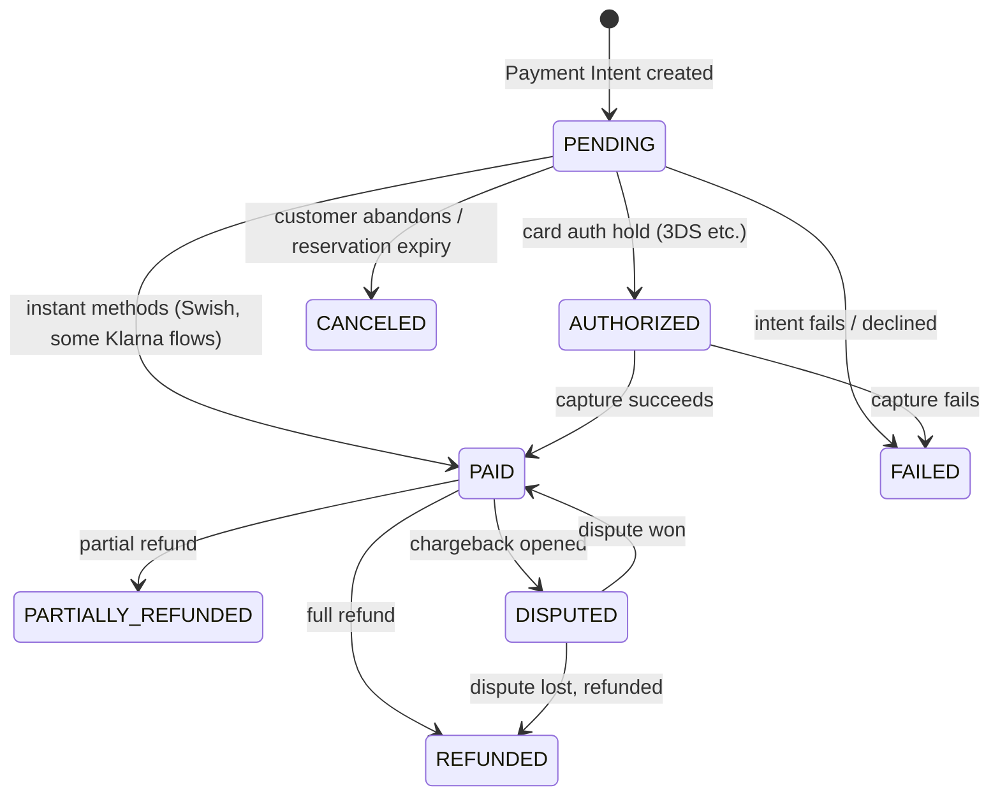
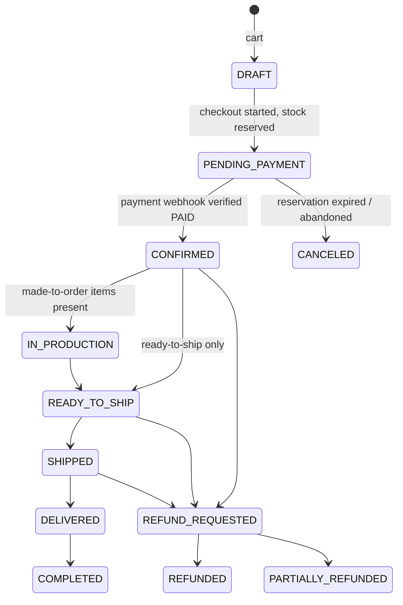

# Payment Architecture — Âme de Fil

See `DECISIONS.md` ADR-014 for the rationale (**flagged for your confirmation**) behind routing Klarna and Swish through Stripe in v1 rather than building direct integrations.

## 1. Provider abstraction

The order/payment domain in `apps/api` depends only on an interface — never on the Stripe SDK directly outside the adapter:

```ts
// Illustrative shape only — not implemented in this phase.
interface PaymentProvider {
  createIntent(order: OrderSnapshot): Promise<PaymentIntentRef>;
  confirmFromWebhook(rawEvent: unknown, signature: string): Promise<PaymentEvent>;
  refund(paymentId: string, amountMinor?: number): Promise<RefundRef>;
  getStatus(paymentId: string): Promise<PaymentStatus>;
}
```

```
PaymentProvider
└── StripePaymentProvider     # v1 — handles card, klarna, swish via Stripe Payment Intents
    (KlarnaPaymentProvider / SwishPaymentProvider as direct-integration
     implementations are a documented future path, not built in v1 — ADR-014)
```

`OrderSnapshot` passed into `createIntent` is always **server-computed** (line items, tax, discounts, shipping re-derived from the database at intent-creation time) — the browser never supplies a total that gets charged.

## 2. Payment state machine



`DISPUTED` is added beyond the brief's list — card disputes/chargebacks are a normal operational reality and need an explicit admin-visible state (`ADMIN.md`-equivalent section in this doc / admin dashboard §Orders).

## 3. Order state machine (independent of payment)



Order and Payment are deliberately **separate** state machines (per the brief) — an order can be `REFUND_REQUESTED` while its payment is still transitioning to `REFUNDED`; they're correlated, not merged, so partial fulfillment/partial refund scenarios (one item refunded, rest shipped) don't force an artificial combined state.

## 4. The core rule: webhooks, not redirects

**An order is never marked `CONFIRMED`, and money is never considered received, because the browser was redirected to a "success" URL.** The success-page redirect only ever shows an optimistic "we're confirming your payment" state. The authoritative transition happens exclusively when:

1. A Stripe webhook arrives at a dedicated endpoint.
2. Its signature is verified against the webhook secret (`stripe.webhooks.constructEvent`).
3. Its event ID is checked against `WebhookEvent` (idempotency ledger, `DATABASE.md` §2) — if already processed, return 200 and no-op.
4. Inside a DB transaction, the reservation is converted to a commit and the state machines advance (`DATABASE.md` §4).

If the webhook hasn't arrived by the time the customer lands on the success page, the frontend polls the order status endpoint (which reflects DB state, not Stripe state) rather than trusting its own redirect.

## 5. Idempotency, retries, reconciliation

- **Client-side idempotency:** checkout submission carries a client-generated `Idempotency-Key` header; `apps/api` stores it against the resulting order/payment so a retried submit (double-click, flaky network) never creates a duplicate order.
- **Webhook retries:** Stripe retries undelivered/failed webhooks automatically; our handler must be safe to receive the same event N times (`WebhookEvent` ledger) and must return 2xx quickly (heavy work — email dispatch, stock commit — is handed to a BullMQ job, not done synchronously in the webhook handler, to avoid Stripe's delivery timeout causing spurious retries).
- **Reconciliation:** a scheduled job (nightly) lists Stripe balance transactions/payment intents for the prior period and diffs them against local `Payment` records, alerting on any mismatch (a payment Stripe shows as succeeded that we never recorded, or vice versa) — this is the safety net for any webhook that was somehow missed entirely.

## 6. Refunds

Full and partial refunds are issued through the provider (`refund()`), recorded as a `Refund` row referencing the originating `Payment`, and drive the order toward `REFUNDED`/`PARTIALLY_REFUNDED`. Refunds restore inventory via a compensating `InventoryMovement` (`DATABASE.md` §4) only if the item hadn't shipped; shipped-item refunds do not restock automatically (handled as a manual admin decision, since the physical item's condition is unknown).

## 7. Abandoned checkout

`PENDING_PAYMENT` orders whose reservation expires without a `PAID` webhook transition to `CANCELED` automatically (via the same BullMQ job that releases the stock reservation). A separate, lower-priority "abandoned cart" email job (distinct from checkout abandonment) may re-engage customers who left items in `Cart` without ever starting checkout — product decision, not built in v1 unless confirmed.

## 8. Security notes (cross-ref `SECURITY.md`)

- Stripe secret keys and webhook signing secrets live only in `apps/api`'s runtime secrets — never shipped to `storefront`/`admin` (only the publishable key reaches the browser, for Stripe.js/Payment Element).
- PCI scope is minimized by using Stripe's Payment Element / hosted fields — raw card data never touches our servers.
- All payment/refund admin actions are written to `AuditLog` (who, when, amount, reason).
